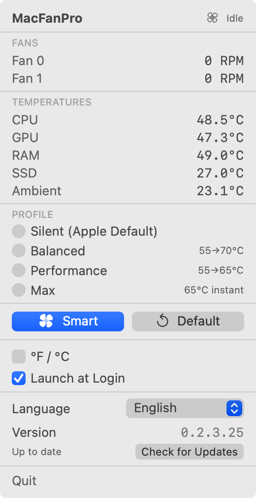
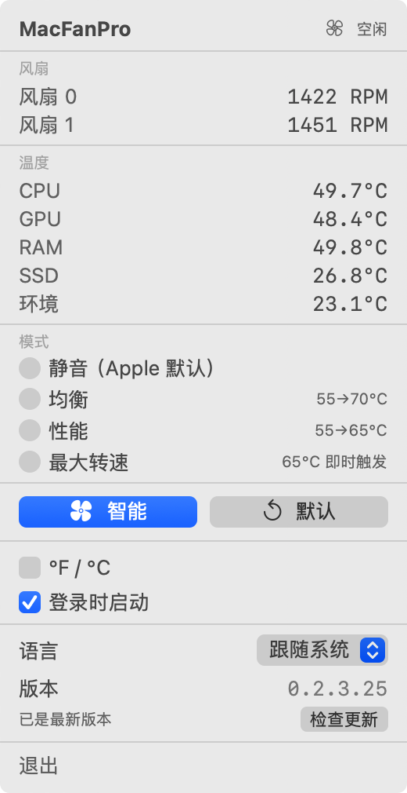
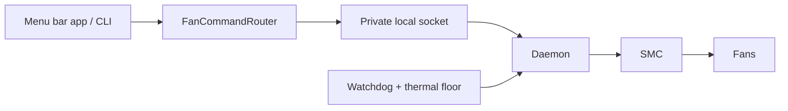

<p align="center">
  
</p>

<h1 align="center">MacFanPro</h1>

<p align="center">
  <b>Fan control for Apple Silicon Macs.</b><br>
  Monitor temperatures in the menu bar, follow smart fan curves, or take control from the command line.<br>
  Native Swift. Free and open source (MIT). Available in 18 languages.
</p>

<p align="center">
  <b>English</b> · <a href="README.zh-CN.md">简体中文</a>
</p>

<p align="center">
  <a href="https://github.com/macfanpro/macfanpro/releases/latest"></a>
  <a href="#requirements"></a>
  <a href="LICENSE"></a>
  <a href="https://github.com/macfanpro/macfanpro/actions/workflows/ci.yml"></a>
</p>

<p align="center">
  <a href="https://macfanpro.github.io/macfanpro/en/"><b>Website · 18 languages</b></a>
  &nbsp;·&nbsp;
  <a href="https://github.com/macfanpro/macfanpro/releases/latest"><b>Download</b></a>
  &nbsp;·&nbsp;
  <a href="#quick-install"><b>Quick install</b></a>
  &nbsp;·&nbsp;
  <a href="#option-1-homebrew"><b>Homebrew</b></a>
</p>

> [!NOTE]
> Requires **macOS 14 or later** and an **Apple Silicon Mac with physical fans**; see [compatibility](#compatibility). Installation needs an administrator password to set up the [background service](#safety-and-permissions). Release packages are not yet notarized by Apple; if macOS blocks the first launch, follow the [first-launch instructions](#macos-says-it-cant-verify-the-developer).

## Quick install

Run this block in Terminal as your normal login user. It downloads and verifies the prebuilt release, then installs the app and background service. No Homebrew or Xcode needed. If GitHub is hard to reach, use the [proxy command](#online-installer) or [configure your proxy on the website](https://macfanpro.github.io/macfanpro/en/#install) before installing.

```bash
(
  set -o pipefail
  curl -fsSL https://github.com/macfanpro/macfanpro/releases/latest/download/install.sh | bash
)
```

When Terminal asks for your administrator password, type your Mac login password and press Return; no characters appear while you type. Already use Homebrew? See [Homebrew installation](#option-1-homebrew). Prefer a manual download? See [release installation](#option-2-release-download).

**Start here:** [Install](#install) · [Choose a profile](#usage) · [Update / proxy](#updating) · [Uninstall](#uninstall)

**Understand and develop:** [Fan curves](#fan-curves-and-smart-mode) · [Safety](#safety-and-permissions) · [Calibration](#optional-calibration) · [Logs](#logs-and-data) · [Compatibility](#compatibility) · [FAQ](#faq) · [Development](#development)

## Why MacFanPro

- **Free and open source** under the MIT license — no paid tier, no license key.
- **Private**: temperature control and logs stay on your Mac. Update checks contact this GitHub repository automatically each day or when requested; installation and updates download files. No telemetry or account is required.
- **Native and light**: a Swift menu bar app and a small background service; no Electron, no Dock icon.
- **Safe by design**: a 95°C safety override, a background thermal floor that works even if the app quits, and a watchdog that hands the fans back to macOS if the app stops responding.
- **Scriptable**: a `macfanpro` CLI to set speeds, read JSON status and record CSV samples.
- **18 languages**, following your system language, including right-to-left Arabic.

An open-source alternative to tools like Macs Fan Control for people who want transparent, scriptable fan control on Apple Silicon.

## Features

<p align="center">
  
  
  <br>
  <sub>MacFanPro 0.2.3.36 on an M4 Max MacBook Pro. English and Simplified Chinese shown; 18 interface languages available.</sub>
</p>

- **Temperature and fan monitoring**: CPU, GPU, memory, SSD and ambient temperatures, and each fan's actual speed. Which readings appear depends on the sensors your Mac provides.
- **Automatic fan control**: Smart, Silent, Balanced, Performance and Max profiles, plus a one-click return to Apple's automatic control.
- **Native menu bar app**: the panel sizes itself to its content; the temperature label reserves room for "icon + two digits + °", stays centered, and widens for three digits.
- **18 interface languages**: English, Simplified Chinese, Traditional Chinese, Japanese, Korean, German, French, Spanish, Italian, Brazilian Portuguese, Russian, Ukrainian, Polish, Dutch, Turkish, Vietnamese, Indonesian and Arabic (laid out right to left), following the system language by default. You can also switch between °C and °F and launch at login.
- **Command line and background service**: set speeds, read status and record CSV samples. Once installed, the app and everyday commands control the fans through the background service.

## Requirements

- An Apple Silicon Mac with macOS 14 or later. Intel Macs are not supported.
- Fan control needs a Mac with fans; fanless models cannot use it.
- Installing or updating the background service needs administrator rights. Building from source needs Xcode 16 or later.

MacBook Pro, Mac mini, Mac Studio and iMac configurations with Apple Silicon and physical fans are relevant targets. A chip family name alone does not establish working fan control; see [Compatibility](#compatibility).

## Install

**Pick one of the methods below; you don't need more than one.** For an existing installation, follow the corresponding [update steps](#updating).

| Method | Best for | Builds on your Mac? |
| --- | --- | --- |
| DMG | Drag the app into Applications, then authorize setup | No, works offline after download |
| Online installer | One command; downloads and verifies a release | No, no Xcode needed |
| Homebrew | Installing and managing versions with Homebrew | No, prebuilt |
| Release download | Using the prebuilt app and CLI | No, no Xcode needed |
| From source | Changing the code, debugging, or building yourself | Yes, needs Xcode |

### Drag to Applications (DMG)

Starting with **0.2.3.50**, download `MacFanPro-<version>-macos-arm64.dmg` for graphical installation:

1. Download the DMG from [Releases](https://github.com/macfanpro/macfanpro/releases/latest), open it, and drag **MacFanPro.app** into **Applications**.
2. Open the app from Applications. If macOS blocks it, follow the [first-launch instructions](#macos-says-it-cant-verify-the-developer); these builds are not notarized.
3. Choose **Install and enable** in the setup window and approve the macOS administrator authorization dialog. The app includes the service executable, so this step needs no network, Homebrew or Xcode.

**To update: download the new version → drag the `.app` into Applications and choose Replace → relaunch it → authorize if prompted. No uninstall or manual service removal is needed; settings, calibration and logs are kept.** If Finder says the app is in use, quit it before replacing it. See [DMG updates](#dmg-updates). Homebrew users should continue updating through Homebrew.

[DMG setup, proxy downloads and developer verification](docs/dmg-installation.md).

### Online installer

```bash
(
  set -o pipefail
  curl -fsSL https://github.com/macfanpro/macfanpro/releases/latest/download/install.sh | bash
)
```

For a first install when GitHub cannot be reached directly, start a proxy and find its local HTTP proxy port. Replace the example port `7890` below and run the complete block. The same command works for later updates:

```bash
(
  export https_proxy=http://127.0.0.1:7890
  set -o pipefail
  curl -fsSL https://github.com/macfanpro/macfanpro/releases/latest/download/install.sh | bash
)
```

For a SOCKS5-only port, replace the `export` line with `export all_proxy=socks5h://127.0.0.1:YOUR_PORT`. [Proxy details and connection check](docs/online-installer.md#代理更新).

Run as your normal login user. The script downloads and verifies the prebuilt package, then asks for your administrator password to install the app and background service. Existing Homebrew installations refresh the project tap and upgrade through Homebrew, retaining Homebrew ownership; the requested version must be available in the tap. Other installations use the release package. Configuration and calibration data are retained; downgrades are refused. Running it again reinstalls/checks the selected version.

To inspect the script first, download `install.sh` and `install.sh.sha256` from the **same release**, then run:

```bash
shasum -a 256 -c install.sh.sha256
less install.sh
bash install.sh
```

Use `bash install.sh --check` to download and validate without installing, `--no-open` to leave the app closed, or `--version 0.2.3.50` to select a package version (a minimum version on Homebrew). The script bundled in each release defaults to that exact release. See [installer details and verification](docs/online-installer.md).

### Option 1: Homebrew

You need [Homebrew](https://brew.sh/). Homebrew installs a prebuilt version, so no Xcode is needed; only if Homebrew can't use it (for example, when installed outside `/opt/homebrew`) does it build from source, which needs Xcode 16 or later.

Run in Terminal:

```bash
brew tap macfanpro/tap
brew trust macfanpro/tap
brew install macfanpro
sudo "$(brew --prefix macfanpro)/bin/macfanpro" install
open /Applications/MacFanPro.app
```

Since Homebrew 7, formulae from third-party taps are not loaded until you trust the tap with `brew trust` (once). Homebrew downloads, builds and manages the version; the `sudo` command installs that version's app and background service. The formula lives in [macfanpro/homebrew-tap](https://github.com/macfanpro/homebrew-tap).

### Option 2: Release download

No Homebrew or Xcode needed.

1. Go to [Releases](https://github.com/macfanpro/macfanpro/releases/latest) and download `MacFanPro-<version>-macos-arm64.tar.gz`. Choose this package, not GitHub's automatic `Source code` archives.
2. Double-click to extract it. Keep `MacFanPro.app` and the `bin` folder together.
3. In Terminal, go into the extracted folder, install, and open the app.

For example, with `0.2.3.50` extracted in Downloads:

```bash
cd ~/Downloads/MacFanPro-0.2.3.50-macos-arm64
sudo ./bin/macfanpro install
open /Applications/MacFanPro.app
```

For another version or location, change the folder path. After a successful install you can delete the archive and the extracted folder.

For drag-and-drop installation with a graphical service setup window, use the DMG above. Administrator authorization is still required to install the background service. Release packages are ad-hoc signed and not yet notarized by Apple, so macOS may warn you the first time; see the [FAQ](#faq).

### Option 3: From source

You need Xcode 16 or later.

```bash
git clone https://github.com/macfanpro/macfanpro.git
cd macfanpro
./setup.sh
```

`setup.sh` builds the code, assembles the app, asks for your administrator password to install, and opens MacFanPro. No further install command is needed.

This builds the repository's `main` branch, which may include unreleased changes. To build a specific release, run `git checkout v0.2.3.50` (with the version you want) before `./setup.sh`.

### After installing

The app is installed at `/Applications/MacFanPro.app`. It lives in the menu bar and has no Dock icon. To start it automatically, turn on Launch at Login in Settings.

Terminal shows nothing while you type your administrator password; press Return when done. The app works with the installed background service, so everyday use doesn't ask for your password again.

## Usage

### Menu bar

Click the fan icon in the menu bar to open the panel, check the sensor readings and choose a profile.

| Profile or button | Behavior |
| --- | --- |
| Silent (Apple Default) | Leaves normal temperatures to Apple's automatic control; it does not force the fans off |
| Balanced | Raises fan speed gradually with temperature, on a gentler curve |
| Performance | Responds faster to rising temperature and allows higher target speeds |
| Max | Runs at full speed once its temperature and duration trigger is met; not always at full speed |
| Smart | Follows temperature and its trend; uses valid calibration data when present, and works without calibrating first |
| Default | Releases the current control and returns to Apple's automatic control |

Overheating protection can override the current profile.

Preferences are in a separate window: choose **Settings** at the bottom of the panel (⌘,). It holds the language, the temperature unit and Launch at Login; the version and update checks; and the background service's status, with setup and removal. The panel itself keeps the readings and profiles, plus a row for a new release when one is available.

### Common commands

Run these individually as needed. With a normal install and the background service running, none of them needs `sudo`.

| Command | Purpose |
| --- | --- |
| `macfanpro --version` | Show the CLI version |
| `macfanpro status` | Print fan speeds and temperatures as JSON |
| `macfanpro max` | Set all fans to maximum now |
| `macfanpro set 3000` | Request 3000 RPM on all fans, within each fan's hardware range |
| `macfanpro set 3000 --fan 0` | Set only fan 0 |
| `macfanpro auto` | Return to Apple's automatic control; the menu bar app keeps running |
| `macfanpro auto --stop-app` | Quit the menu bar app and return to Apple's automatic control |
| `macfanpro log --duration 60s` | Record 60 seconds of sensor data to CSV |
| `macfanpro --help` | List all commands; add `--help` to any command for details |

`max` and `set` create a speed held from Terminal; the app shows a notice and pauses its own control. Press Default, pick a profile, or run `macfanpro auto` to release it. Quitting the menu bar app alone does not release a speed held from Terminal.

`macfanpro auto` does not quit the app, and the app's automatic profiles may take over again. To hand control back to macOS completely, use `macfanpro auto --stop-app`.

The advanced `watch` command keeps controlling the fans by profile (it is not read-only). It supports `silent`, `balanced`, `performance` and `max`; Smart is selected in the menu bar app. Calibration is optional and creates a load; see [Calibration](#optional-calibration). Both controlling `watch` and running a calibration need administrator rights. Quit the menu bar app before starting `watch`; its polling interval must be 0.01–5 seconds. Calibration closes the invoking user's app and reopens it afterwards. Both commands use the installed daemon for fan writes and refuse to start over an existing manual CLI hold; finish that hold first. Ctrl-C or SIGTERM stops the foreground session and releases its control. Read the command's `--help` before using either.

Actual RPM is the fan's measured speed, so it can differ slightly from the requested target. Minimum and maximum RPM also vary by fan and model. When the daemon is unavailable, direct `max`/`set` writes need administrator rights; install the service for ordinary use.

## Fan curves and Smart mode

Start with **Smart** for automatic control, **Balanced** for a gentler curve, or **Silent** to leave ordinary fan decisions to macOS. The values below describe the current built-in profiles, before hardware limits and safety overrides.

| Profile | Start temperature | Time above start | Curve ceiling | Maximum target | Curve |
| --- | --- | --- | --- | --- | --- |
| Silent (Apple Default) | macOS decides | — | — | macOS decides | No ordinary manual control |
| Balanced | 55°C | 8 s | 70°C | 60% | Ease-in: `x²` |
| Performance | 55°C | 4 s | 65°C | 85% | Linear: `x` |
| Max | 65°C | 5 s | 65°C | 100% | Immediate maximum once triggered |
| Smart | 53°C | 6 s | 85°C | 100% | S-curve: `x²(3 − 2x)`, or a valid calibration lookup, plus temperature trend |

`x` is the temperature's position between start and ceiling, clamped to 0–1: `(temperature − start) / (ceiling − start)`.

The percentages refer to hardware maximum RPM, not a percentage of the range between minimum and maximum. A running fan is clamped to its own supported range. The **curve ceiling** is where the base curve asks for its maximum; it is not a promised temperature cap. Ramping, firmware handoff and workload changes take time.

### Why a brief temperature spike does not immediately start the fans

**Sustained trigger:** the temperature must stay at or above the start threshold for the listed duration. A drop below start resets that timer. This filters short bursts such as opening an app. The separate 95°C safety override bypasses ordinary profile timing.

**Hysteresis:** start and release temperatures differ, so a reading near one threshold does not repeatedly switch the fans on and off. Balanced, Performance and Max release their manual control at or below 50°C. Smart releases below 50°C when its recent trend is flat or falling. Between release and start, a stopped profile stays stopped; an engaged profile can keep the fans near minimum while ramping down.

Here, “off” means **release manual control to macOS**. Firmware may stop the fans or keep them turning. Seeing `system` or `auto` and 0 RPM can be normal with Smart selected; the profile is still monitoring temperature.

### How Smart anticipates rising temperature

Without calibration, Smart maps 53–85°C onto an S-curve. A rising temperature trend adds demand before the base curve alone would reach that speed. With valid calibration, an interpolated lookup supplies the base demand, with an additional trend adjustment. Above 85°C it requests a 100% target, subject to the ordinary ramp governor; the 95°C protection is a separate maximum-speed path.

Smart estimates the trend from recent samples taken about two seconds apart. By default, the control loop runs every **100 ms**, the interface receives readings every **500 ms**, and anomaly/process logging runs every **2 s**. These are scheduling intervals, not guarantees that a hardware operation finishes in that time.

The ramp governor limits how quickly the requested speed changes. Smart and Balanced use **5% of maximum RPM per second upward** and **2.5% downward**; Performance uses **10% / 4%**. For a 5,777 RPM fan, Smart's nominal limits are about 289 RPM/s up and 144 RPM/s down. Moving from stopped to the hardware minimum is a separate transition. Max skips the upward governor after its trigger, but still ramps down.

Earlier cooling can reduce heat buildup during sustained compilation, rendering or inference. Actual temperature, noise and throughput depend on the machine, room temperature and workload. The profile does not guarantee an 85°C maximum, a fixed performance gain or a measured increase in fan lifespan.

The implementation is in [Profile.swift](Sources/MacFanProCore/Profile.swift) and [ThermalMonitor.swift](Sources/MacFanProCore/ThermalMonitor.swift). The concepts are adapted from [ThermalForge's technical documentation](https://github.com/ProducerGuy/ThermalForge/blob/93ed7d2df231b079704156b5ae67654a50d31f62/README.md#smart-profile), with the descriptions checked against this fork.

## Safety and permissions

The menu bar app runs as your login user. A root-owned background service performs privileged fan writes through a local socket; this is why installing or replacing the service asks for an administrator password.

| Mechanism | What it does |
| --- | --- |
| 95°C / 90°C protection | The app's monitor requests maximum speed at 95°C and keeps the override until below 90°C. The daemon independently protects against a recorded manual hold keeping fans below maximum at high temperature. This daemon protection works while the app is closed. |
| Heartbeat watchdog | For app-supervised holds, a heartbeat older than 15 s is treated as expired on the watchdog's next check (normally every 5 s). It attempts to return control to macOS; an active thermal override keeps maximum speed until cooldown. |
| Terminal ownership | Deliberate `max`/`set` CLI holds are unsupervised: closing the app or losing its heartbeat does not cancel them. Release them with Default, a profile selection, or `macfanpro auto`. |
| Sleep/wake recovery | The daemon attempts to reapply its current hold after wake, while retaining the safety override and retrying failed releases. Firmware readiness differs by machine. |
| Local access control | `/var/run/macfanpro.sock` uses mode `0600` and belongs to the installation's designated user. Each connection is also checked against kernel-provided credentials: only that user and root are allowed; unreadable credentials are rejected before a request is read. |
| Bounded requests | Versioned messages, size limits, timeouts, bounded concurrent clients and write-rate limits protect the service. Hardware writes are serialized and RPM requests are checked against the fan's range. |

The protections depend on working software, firmware and sensor readings; they are not a guarantee against every hardware or thermal failure. The daemon's thermal floor is a backstop for its manual holds, not a replacement for macOS's own control when no hold exists. The safety temperature follows the hottest selected CPU/GPU sensor, which can differ from the value displayed in the menu; see [Sensor readings](#temperatures-dont-match-stats-or-similar-tools).

## Optional calibration

**Smart works without calibration.** Calibration measures this machine under load to build a temperature-to-fan lookup. Use it only when you want to investigate or tune that behavior, and set aside time when the Mac can run a sustained workload.

Read the available modes first:

```bash
macfanpro calibrate --help
```

To deliberately start a standard CPU + GPU calibration:

```bash
sudo macfanpro calibrate --mode standard --stress combined
```

Modes are `quick`, `standard` and `optimized`; workloads are `cpu`, `gpu` and `combined`. Completion time depends on thermal settling. This operation creates load, changes fan speeds and temporarily closes a running menu bar app so the app cannot overwrite the measurements. Normal completion reopens it. If interrupted with Ctrl-C, the command attempts to restore Apple control; reopen MacFanPro afterwards and check your selected profile or previous Terminal hold.

Results live in `~/Library/Application Support/MacFanPro/calibration.json`, with a CSV trace for analysis. Saving is atomic and a result rejected by validation does not replace an existing calibration. Selecting Smart reloads the data; missing or rejected data uses the default curve. Keep workload and ambient conditions comparable when assessing whether calibration helped.

To intentionally discard calibration and use the default curve again, run `macfanpro calibrate --reset`, then reselect Smart. This deletes your calibration file; it is not required for an update.

## Updating

The online installer above also upgrades existing installations. The app’s “Update in Terminal” uses the same bundled installer.

The app checks this repository's releases once a day. In **Settings → Updates**, **Check for Updates** checks immediately. When a release is found, the panel shows a "{version} available" row and a dot on **Settings**; click the row to open Settings, where the **Updates** section at the bottom shows the new version, a **What's new** link and the update action. Homebrew users get **Update in Terminal**; other installations get **Open download page** to download and replace the app. Selectable installer/source commands and network help are collapsed under **Other update methods** and **Download help**. Closing Settings keeps the update visible in the panel. A Terminal handoff does not mean installation has finished; follow Terminal's output. The app never replaces itself without your action. Checks use the macOS system proxy; if a manual check fails, check your connection and click **Retry**.

### DMG updates

1. Download and open the new DMG, drag **MacFanPro.app** into Applications, and choose **Replace**. If Finder says the app is in use, quit MacFanPro and retry.
2. **Relaunch MacFanPro**. If the old app is still running, quit it and open it again so the new version starts.
3. If the service needs synchronization, choose **Install and enable** in the setup window and approve the macOS authorization dialog. If the versions already match, the app is ready to use.

**Do not uninstall or choose Remove background service when updating.** The app handles service synchronization and preserves settings, calibration and logs. Homebrew-managed installations continue to use the Homebrew update flow below.

### Update through a proxy

If GitHub is unreachable, start a trusted proxy and find its **local HTTP proxy port**. Replace `7890` below with that port, then run the complete block in Terminal. The parentheses limit the setting to this update:

```bash
(
  export https_proxy=http://127.0.0.1:7890
  set -o pipefail
  curl -fsSL https://github.com/macfanpro/macfanpro/releases/latest/download/install.sh | bash
)
```

This covers the initial script download, release assets, the Homebrew tap and its bottle downloads. Homebrew installations remain managed by Homebrew. Run as your normal login user; the background service install asks for an administrator password later. If your proxy offers only SOCKS5, use `export all_proxy=socks5h://127.0.0.1:7890` instead of the `export` line above; `socks5h` resolves GitHub names through the proxy. [Proxy details and a read-only check](docs/online-installer.md#代理更新).

The in-app update check uses the macOS system proxy. “Update in Terminal” reads the system HTTPS proxy, or the system SOCKS5 proxy when HTTPS proxy is disabled. If your proxy app does not enable the macOS system proxy, use the Terminal command above. A failed connection stops before installation.

### Homebrew

```bash
brew update
brew upgrade macfanpro
macfanpro auto --stop-app
sudo "$(brew --prefix macfanpro)/bin/macfanpro" install
open /Applications/MacFanPro.app
```

`auto --stop-app` intentionally stops the app and releases fan control during replacement. After reopening, check that your previous profile is selected; a deliberate CLI hold needs to be set again.

`brew upgrade` updates Homebrew's copy; the background service and the app in `/Applications` still need syncing afterwards. If Homebrew reports an `untrusted tap`, run `brew trust macfanpro/tap` once. `brew --prefix` points at the version you just upgraded to, instead of an older system copy.

### Release download

Download and extract the new version, quit the running app, go into the **new version's extracted folder**, and repeat the release install steps. The installer replaces the app and the background service; you don't need to uninstall first, and your data is kept.

### From source

If you cloned the `main` branch as above, save your own changes, quit the app, and run in the source folder:

```bash
git pull --ff-only
./setup.sh
```

For an app built with `setup.sh`, **Other update methods** in **Settings → Updates** shows this as one command that starts with `cd` into your source folder, ready to copy.

If you checked out a release tag, run `git fetch origin --tags`, check out the new tag, and run `./setup.sh`.

## Uninstall

These steps are only for **stopping use of MacFanPro**, not for updating it.

**DMG installation**: choose **Settings → Background service → Remove background service**, confirm and authorize, then quit the app and move MacFanPro.app to the Trash. Settings, calibration and logs are kept.

Alternatively, remove the app, command-line tool and background service with this command, keeping your data:

```bash
sudo macfanpro uninstall
```

To also delete your profiles, calibration data, samples and runtime logs, and the background service's logs, run this **instead**:

```bash
sudo macfanpro uninstall --purge-data
```

If you installed with Homebrew, also run afterwards:

```bash
brew uninstall macfanpro
```

`--purge-data` removes your `~/Library/Application Support/MacFanPro/` and `~/Library/Logs/MacFanPro/`, and the background service's `/var/root/Library/Logs/MacFanPro/`. It does not delete custom export folders or separately stored interface preferences. Dragging the app to the Trash or running only `brew uninstall` does not remove the background service.

## Logs and data

### Record a workload

For a short capture, use `macfanpro log --duration 60s`. Invalid or nonpositive durations are rejected. Logging does not need sudo; if launched with sudo, it drops to the invoking user before creating recordings, so the files remain accessible to that user. For a 10 Hz, one-hour session that you want to retain:

```bash
macfanpro log --rate 10 --duration 1h --no-expire
```

`log` records readings without choosing a profile or commanding fan speeds. Each session contains:

| File | Contents |
| --- | --- |
| `thermal.csv` | Timestamps, detected temperature keys, each fan's actual/target RPM and hardware mode |
| `processes.csv` | The top CPU-consuming processes captured with the samples |
| `metadata.json` | Machine identifier, OS and application version, fan range, sample rate, sensor keys, timestamps and sample count |

CSV and JSON can be opened in pandas, R or a spreadsheet. Raw SMC keys help compare repeated runs, but their meanings vary by chip generation. The version field in metadata retains the historical key `thermalForgeVersion` for compatibility; its value is the MacFanPro version.

For a useful comparison, record the same workload, profile, calibration, ambient conditions and duration, and measure workload throughput separately. CPU-process correlation alone does not measure GPU utilization, power draw, clock throttling or prove why a temperature changed. Logs include process names; review them before sharing.

Runtime anomaly messages flag changes greater than 5°C between approximately two-second samples, or 10°C across approximately 30 seconds, with recent process history. They help find a time window to investigate; a spike alone is not a hardware-fault diagnosis.

### Storage and retention

Runtime logs and manual samples are kept under different rules:

| Data | Default location | Retention |
| --- | --- | --- |
| App runtime logs | `~/Library/Logs/MacFanPro/` | Up to 7 calendar days (including today), 5 MiB per file, 50 MiB in total for managed logs in the folder |
| Background service logs | `/var/root/Library/Logs/MacFanPro/` | Same as the app's, counted separately |
| Temporary CSV samples | `~/Library/Application Support/MacFanPro/logs/` | Up to 100 MiB per recording, kept 24 hours after it ends normally |
| Profiles and calibration | `~/Library/Application Support/MacFanPro/` | Not cleaned up by the log rules |

Runtime logs are pruned at launch, when a new file starts (size limit or a new day) and hourly while running; together the two managed log folders hold at most 100 MiB by default. If writing to disk fails, file logging pauses and retries later, with a bounded queue.

Background service logs belong to root and need administrator rights to read, for example the last 50 lines of today's log:

```bash
sudo tail -n 50 "/var/root/Library/Logs/MacFanPro/macfanpro-$(date +%F).log"
```

The background service also writes its diagnostics to the system log (from 0.2.3.56): starting, fan release at start and stop, the thermal floor, sleep/wake and each request's outcome. No administrator rights are needed to read them:

```bash
log show --last 1h --style compact --predicate 'subsystem == "io.github.macfanpro.daemon"'
```

A temporary sample stops and keeps its data when it reaches its size limit. Its expiry is set when it ends normally, on Ctrl-C or on SIGTERM; an abnormal exit also leaves a marker so it can be cleaned up. Expired samples that are no longer being written are removed at app launch, hourly while the app runs, and when the next sample starts. While the app isn't running, your samples stay until the next cleanup. Sample folders left by older versions without an expiry marker can't be told apart from manual exports, so they are never deleted automatically; remove them yourself if you don't need them.

**The 100 MiB limit applies to each recording, not to the sample folder as a whole.** Samples made with `--output <folder>` or `--no-expire` are kept permanently without that limit; manage them yourself. Older samples without an expiry marker and other files are not deleted automatically.

## Compatibility

Fan control needs **Apple Silicon, macOS 14+, and physical fans**. Intel Macs and fanless Macs such as MacBook Air are outside the fan-control scope. SMC key names, firmware handoff delays and RPM ranges differ by hardware; successful building alone is not a compatibility test.

| Evidence | Scope |
| --- | --- |
| MacFanPro testing on an M4 Max MacBook Pro | Includes [documented thermal and full sleep/wake checks](docs/macfanpro-0.2.3.23-hardware-validation.md), plus later per-release checks. These records describe the versions tested, not every future build. |
| ThermalForge upstream reports | The [upstream compatibility table](https://github.com/ProducerGuy/ThermalForge/blob/93ed7d2df231b079704156b5ae67654a50d31f62/README.md#compatibility) lists additional MacBook Pro, Mac Studio and Mac mini configurations, with chip families through M6. The latest additions include a reported 14-inch M4 Pro MacBook Pro (2024) and years on the Mac mini entries. Those are upstream claims, not independent MacFanPro acceptance results. |

For a new machine, collect read-only information first:

```bash
macfanpro --version
macfanpro status
macfanpro discover --output discover.txt
```

Open a [compatibility report](https://github.com/macfanpro/macfanpro/issues/new?template=compatibility-report.md) with the exact model, chip, year, macOS version and installation method. Include which actions you actually tested; do not infer fan-write or wake support from temperature readings alone.

## FAQ

### Smart is selected, but status shows `system` or 0 RPM

Smart remains selected while idle. Below its release threshold it allows macOS to control the fans, and firmware can leave them stopped. The selected profile describes the policy; `system`, `auto` and `manual` describe the hardware's current mode. They are different readings.

### Fans remain at a fixed speed after closing the app

Check for a “Fans held from Terminal” banner. An explicit CLI hold survives app exit. Select the profile you want in the app to resume automatic control. If you intentionally want Apple control, use Default or `macfanpro auto`; `--stop-app` also quits the app. Do not use that option as a generic “close app” command: it changes fan ownership.

### The background service is unavailable or its version doesn't match

The app, the CLI and the background service must come from the same version. Quit the app, then repeat the install or sync steps for how you installed: Homebrew users use the formula's CLI, release-download users use `./bin/macfanpro` in the extracted folder. Then reopen the app. If it still fails, keep the Terminal error and the logs from that time for troubleshooting.

### macOS says it can't verify the developer

Release packages are not yet notarized by Apple. If you're sure the file came from this repository and hasn't been tampered with, follow [Apple's instructions](https://support.apple.com/102445): after trying to open it, go to System Settings → Privacy & Security and look for Open Anyway.

Each release includes `SHA256SUMS`. Put it in the same folder as the archive and run `shasum -a 256 -c SHA256SUMS` to verify the download. A checksum is not the same as Apple notarization.

### Temperatures or fan readings differ from another Mac

Models differ in their sensors, number of fans and speed ranges. When reporting an issue, include your Mac model, macOS version, MacFanPro version, install method, steps to reproduce, and the relevant status output or log excerpt. Report issues at [Issues](https://github.com/macfanpro/macfanpro/issues).

### Temperatures don't match Stats or similar tools

MacFanPro's CPU and GPU rows show the **highest** reading of their sensors. Compare them with Stats' "Hottest CPU / Hottest GPU", not "Average". On the M4 family, the CPU row uses the same core sensors as Stats; other chips group sensors by prefix, which may differ from other tools. Fan control and the 95°C safety threshold follow the chip's hottest point, including hotspot sensors that the CPU row doesn't show, so the fans may speed up before the CPU or GPU rows reach the threshold. The comparison method and measurements are in the [sensor calibration record](docs/thermal-sensor-calibration-20260924.md).

## Development

### Architecture and control ownership



The app's `ThermalMonitor` computes profile demand. `AppState` sends commands asynchronously and tracks acknowledgements; the daemon owns serialized hardware writes and control ownership. Read-only CLI commands can read SMC directly; CLI `max`/`set` use the daemon when available and can fall back to direct writes with appropriate privileges.

Preserve the distinction between an app-supervised hold and a deliberate CLI hold. A queued release from an older profile must not clear newer user intent. The [fan-state repair notes](docs/fan-state-fixes-20260927.md), [M4 handoff notes](docs/m4-handoff-repair.md) and their regression tests explain those constraints.

### Project layout

| Path | Contents |
| --- | --- |
| [`Sources/MacFanProApp/`](Sources/MacFanProApp/) | SwiftUI menu bar app, UI state and interaction |
| [`Sources/MacFanProCore/`](Sources/MacFanProCore/) | SMC access, fan control, background service communication, profiles and logging |
| [`Sources/MacFanProLocalization/`](Sources/MacFanProLocalization/) | Language selection and translations |
| [`Sources/macfanpro/`](Sources/macfanpro/) | CLI, app assembly, install and uninstall |
| [`Tests/MacFanProTests/`](Tests/MacFanProTests/) | Automated tests |
| [`Scripts/`](Scripts/) | Test, localization check and release packaging scripts |
| [`website/`](website/) | GitHub Pages website, with translations for all 18 languages |

### Build and test

From the repository root:

```bash
bash Scripts/test.sh --all-configurations
bash Scripts/check-localization-package.sh
```

These commands build and test the project without installing anything. `--all-configurations` runs Swift tests in Debug and Release, then runs the client-disconnect regression and installer integration tests once. For a single configuration, use `bash Scripts/test.sh` (Debug) or `bash Scripts/test.sh -c release`. CI uses the same combined command and checks localization packaging.

To build a release package locally:

```bash
bash Scripts/package-release.sh
```

Output goes to `dist/`: a `.tar.gz` with the app and CLI, `SHA256SUMS`, and the version-pinned `install.sh` and `install.sh.sha256`. Packaging doesn't replace the installed app; run `./setup.sh` when you want to install a development build.

When opening a [Pull Request](https://github.com/macfanpro/macfanpro/pulls), describe the problem, the scope of the change and how you verified it. Changes to fan control, background service communication or native menu behavior should include matching hardware checks, keeping automated tests, isolated rendering tests and real hardware results distinct.

### Documentation and upstream maintenance

- [Website](https://macfanpro.github.io/macfanpro/en/) and [website maintenance](website/README.md): the 18-language introduction, installation commands and GitHub Pages build instructions.
- [Documentation index](docs/README.md): user guides, technical notes and validation history, grouped by task.
- [Changelog](CHANGELOG.md) and [release notes](docs/releases/README.md): what changed in published versions and how releases are prepared.
- [Upstream differences](docs/upstream-divergence.md) and [2026-10-03 integration review](docs/upstream-sync-20261003.md): which fork behaviors must survive an upstream merge and what was checked this time.
- [GUI localization](docs/gui-localization.md): language catalogs, placeholders, right-to-left layout and packaged resources.

Some upstream README items, including `experiment`, `compare`, GPU/power metrics and a shared thermal database, are proposals. This CLI does not provide them. Check `macfanpro --help` for implemented commands. Historical documents in `docs/upstream/` and earlier validation records describe their original versions, not the current feature set.

Versions are **the upstream version plus a fourth revision number**, defined in [`Version.swift`](Sources/MacFanProCore/Version.swift). For example, `0.2.3.15` is based on upstream `0.2.3`; the first three parts change only after a new upstream release is merged. The app and CLI compare versions part by part numerically, treating missing parts as 0, with no special cases for older versions.

## Contributing

All kinds of contributions are welcome — see [CONTRIBUTING.md](CONTRIBUTING.md) for details. For questions and ideas, use [Discussions](https://github.com/macfanpro/macfanpro/discussions); report security problems privately as described in [SECURITY.md](SECURITY.md).

- **Bug reports**: report problems or submit a compatibility report in [Issues](https://github.com/macfanpro/macfanpro/issues), with your Mac model, macOS version, MacFanPro version and `macfanpro status` output.
- **Code**: build and test as described in [Development](#development), then open a [Pull Request](https://github.com/macfanpro/macfanpro/pulls).
- **Translations**: the interface translations were made by the maintainer; native speakers are welcome to correct them or add a language. See [GUI localization](docs/gui-localization.md).

### Contributors

<a href="https://github.com/macfanpro/macfanpro/graphs/contributors">
  
</a>

## Credits and license

MacFanPro is maintained by [@hongyukeji](https://github.com/hongyukeji) under the [MIT License](LICENSE). It is independently maintained on top of [ThermalForge](https://github.com/ProducerGuy/ThermalForge), with its own versions, install names and update channel; it is not an official upstream release. The ThermalForge upstream copyright and license are kept in full; see [NOTICE.md](NOTICE.md) and [ThirdPartyNotices/](ThirdPartyNotices/) for the derivation and third-party dependencies.
