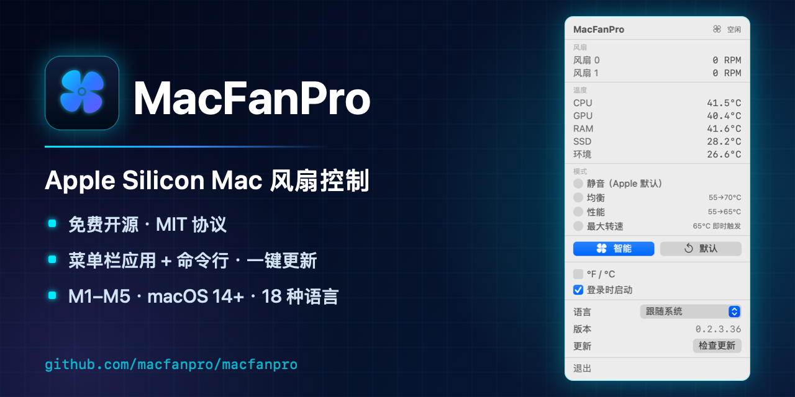
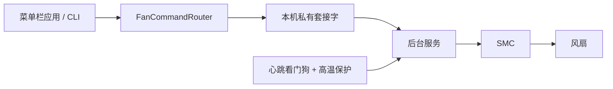

# MacFanPro

[](https://github.com/macfanpro/macfanpro/actions/workflows/ci.yml)
[](https://github.com/macfanpro/macfanpro/releases/latest)
[](LICENSE)

[English](README.md) | **简体中文**



**Apple Silicon Mac 风扇控制工具 —— 免费、开源、原生。**

在菜单栏查看 CPU、GPU 温度和风扇转速，让风扇按智能曲线随温度自动调节，也可以通过命令行完全掌控。面向带有实体风扇的 Apple Silicon Mac，要求 macOS 14 或更高版本；具体机型请查看[兼容性与验证范围](#兼容性与验证范围)。

 

### 快速安装

已安装 Homebrew 的用户可执行下面的命令；没有 Homebrew 或 Xcode，可用[在线安装脚本](#在线安装脚本)。**中国大陆用户如果无法直连 GitHub，请先使用该节中的代理安装命令，首次安装和后续更新均适用。**

```bash
brew tap macfanpro/tap && brew trust macfanpro/tap
brew install macfanpro
sudo "$(brew --prefix macfanpro)/bin/macfanpro" install
open /Applications/MacFanPro.app
```

也可以[直接下载应用](https://github.com/macfanpro/macfanpro/releases/latest)，全部安装方式见[安装](#安装)。

**开始使用：** [安装](#安装) · [选择模式](#使用) · [更新与代理](#更新) · [卸载](#卸载)

**深入了解：** [曲线与智能模式](#风扇曲线与智能模式原理) · [安全机制](#安全机制与权限) · [校准](#可选的本机校准) · [日志](#日志与数据) · [兼容性](#兼容性与验证范围) · [常见问题](#常见问题) · [开发](#开发与贡献)

## 为什么选择 MacFanPro

- **免费开源**：MIT 协议，没有付费版，也不需要激活码。
- **不收集数据**：温控和日志保留在本机；每天自动或手动检查更新时访问本 GitHub 仓库，安装与更新时下载文件。没有遥测，不需要账号。
- **原生轻量**：Swift 编写的菜单栏应用加一个小型后台服务，不是 Electron，不占 Dock。
- **安全设计**：95°C 高温保护；后台服务自带高温兜底，应用退出后仍然生效；应用失去响应时，看门狗会把风扇交还 macOS。
- **可脚本化**：`macfanpro` 命令行可以设置转速、输出 JSON 状态、记录 CSV 数据。
- **18 种界面语言**，默认跟随系统语言，包括从右往左书写的阿拉伯语。

如果你想在 Apple Silicon 上用透明、可脚本化的方式控制风扇，它是 Macs Fan Control 等工具的开源替代品。

## 功能与界面

- **温度与转速监测**：查看 CPU、GPU、内存、SSD、环境温度及各风扇实际转速，具体读数取决于机型提供的传感器。
- **自动风扇控制**：提供智能、静音、均衡、性能和最大转速模式，也可恢复 Apple 自动控制。
- **原生菜单栏界面**：弹窗高度随内容调整；温度标签按“图标＋两位数字＋°”预留最小宽度，内容整体居中，三位数时扩展。
- **18 种界面语言**：英语、简体中文、繁体中文、日语、韩语、德语、法语、西班牙语、意大利语、葡萄牙语（巴西）、俄语、乌克兰语、波兰语、荷兰语、土耳其语、越南语、印尼语和阿拉伯语（从右往左排版），默认跟随系统语言；另可切换摄氏/华氏及登录时启动。
- **命令行与后台服务**：支持指定转速、读取状态和 CSV 数据采样；正常安装后，应用和普通控制命令通过后台服务操作风扇。

上方截图为 MacFanPro 0.2.3.36 在 M4 Max MacBook Pro 上的实际运行界面。

## 系统要求

- Apple Silicon Mac，macOS 14 或更高版本；不支持 Intel Mac。
- 风扇控制需要带风扇的机型，无风扇机型无法使用该功能。
- 首次安装或更新后台服务需要管理员权限；从源码构建还需要 Xcode 16 或更高版本。

适用方向包括配备 Apple Silicon 和实体风扇的 MacBook Pro、Mac mini、Mac Studio、iMac。芯片系列名称本身不能证明风扇控制兼容，已知证据见[兼容性与验证范围](#兼容性与验证范围)。

## 安装

以下方式**选择一种即可，不需要依次执行**。如果 MacFanPro 已在运行，请先在菜单中点击“退出”。

| 安装方式 | 适合场景 | 是否需要本机编译 |
| --- | --- | --- |
| 在线安装脚本 | 一条命令下载、校验并安装发行包 | 否，无需 Xcode |
| Homebrew | 使用 Homebrew 安装和管理版本 | 否，使用预编译版本 |
| 下载发行包 | 直接使用已编译的应用和 CLI | 否，无需 Xcode |
| 源码构建 | 修改代码、调试或自行构建 | 是，需要 Xcode |

### 在线安装脚本

```bash
curl -fsSL https://github.com/macfanpro/macfanpro/releases/latest/download/install.sh | bash
```

首次安装时若 GitHub 无法直连，打开代理软件，确认其本地 HTTP 代理端口，然后复制以下整段命令。`7890` 仅为示例，换成实际端口；这条命令以后也能用于更新：

```bash
(
  export https_proxy=http://127.0.0.1:7890
  set -o pipefail
  curl -fsSL https://github.com/macfanpro/macfanpro/releases/latest/download/install.sh | bash
)
```

如果只有 SOCKS5 端口，把 `export` 一行改为 `export all_proxy=socks5h://127.0.0.1:实际端口`。[代理说明与连接检查](docs/online-installer.md#代理更新)

以普通登录用户运行。脚本会下载并校验预编译包，然后请求管理员密码，安装应用和后台服务。已有 Homebrew 安装会刷新本软件源并通过 Homebrew 升级，继续由 Homebrew 管理；需要等待软件源提供所请求的版本。其他安装使用发行包。保留配置和校准数据，拒绝降级；重复运行可重新安装并检查所选版本。

如需先检查脚本，从**同一个发行版本**下载 `install.sh` 和 `install.sh.sha256`，然后运行：

```bash
shasum -a 256 -c install.sh.sha256
less install.sh
bash install.sh
```

`bash install.sh --check` 只下载和校验，不安装；`--no-open` 安装后不打开应用；`--version 0.2.3.37` 指定发行包版本（在 Homebrew 路径中表示最低版本）。每个发行附件中的脚本默认固定到所属版本。更多说明见[安装器与验证](docs/online-installer.md)。

### 方式一：通过 Homebrew 安装

前提：已安装 [Homebrew](https://brew.sh/zh-cn/)。Homebrew 会直接安装预编译版本，无需 Xcode；只有在无法使用预编译版本时（例如 Homebrew 不在 `/opt/homebrew`），才会在本机从源码构建，此时需要 Xcode 16 或更高版本。

在终端中依次执行：

```bash
brew tap macfanpro/tap
brew trust macfanpro/tap
brew install macfanpro
sudo "$(brew --prefix macfanpro)/bin/macfanpro" install
open /Applications/MacFanPro.app
```

Homebrew 7 起默认不加载第三方 tap 的配方，需要先用 `brew trust` 明确信任本 tap（只需一次）。Homebrew 负责下载、编译和管理版本；`sudo` 那条命令将对应版本的应用和后台服务安装到系统中。配方维护在 [macfanpro/homebrew-tap](https://github.com/macfanpro/homebrew-tap)。

### 方式二：下载发行包安装

此方式无需安装 Homebrew 或 Xcode。

1. 前往 [Releases](https://github.com/macfanpro/macfanpro/releases/latest)，下载 `MacFanPro-版本号-macos-arm64.tar.gz`。请选择这个发行包，而非 GitHub 自动生成的 `Source code` 源码包。
2. 双击解压，保留文件夹内的 `MacFanPro.app` 和 `bin` 目录。
3. 在终端中进入解压后的文件夹，执行安装并打开应用。

例如，`0.2.3.37` 解压在“下载”目录时：

```bash
cd ~/Downloads/MacFanPro-0.2.3.37-macos-arm64
sudo ./bin/macfanpro install
open /Applications/MacFanPro.app
```

其他版本或下载位置，请相应替换文件夹路径。安装成功后，可以删除压缩包和解压文件夹。

仅将 `MacFanPro.app` 拖入“应用程序”目录，无法完成后台服务安装。当前发行包使用 ad-hoc 签名，尚未经过 Apple 公证，首次运行可能出现 macOS 安全提示，见[常见问题](#常见问题)。

### 方式三：从源码构建安装

前提：已安装 Xcode 16 或更高版本。

```bash
git clone https://github.com/macfanpro/macfanpro.git
cd macfanpro
./setup.sh
```

`setup.sh` 会编译源码、组装应用、请求管理员权限完成安装，并打开 MacFanPro，无需再执行其他安装命令。

此方式默认构建仓库的 `main` 分支，可能包含尚未发行的修改。如需构建指定发行版，可在运行 `./setup.sh` 前执行 `git checkout v0.2.3.37`，版本号按需替换。

### 安装完成后

应用安装在 `/Applications/MacFanPro.app`，打开后显示在菜单栏中，不显示 Dock 图标。需要登录后自动运行时，在应用中勾选“登录时启动”。

终端输入管理员密码时不会显示字符，输入完成后按回车即可。应用与已安装后台服务配合工作，日常使用无需重复输入密码。

## 使用

### 菜单栏控制

点击菜单栏风扇图标打开控制面板，查看传感器读数并选择模式。

| 模式或按钮 | 行为 |
| --- | --- |
| 静音（Apple 默认） | 常规温度下交由 Apple 自动控制，并非强制关闭风扇 |
| 均衡 | 根据温度逐步提高转速，采用较缓和的响应曲线 |
| 性能 | 更快响应温度上升，允许更高的目标转速 |
| 最大转速 | 达到温度及持续时间触发条件后使用最高转速，并非始终全速 |
| 智能 | 根据温度及变化趋势调节转速；有有效校准数据时结合使用，无需先校准也能运行 |
| 默认 | 取消当前接管并恢复 Apple 自动控制 |

高温保护逻辑可能覆盖当前模式。

菜单中还可切换温度单位、登录时启动和语言，查看当前版本号，并手动检查更新。

### 常用命令

以下命令按需要单独执行。正常安装且后台服务运行时，表中的命令无需 `sudo`。

| 命令 | 用途 |
| --- | --- |
| `macfanpro --version` | 查看当前 CLI 版本 |
| `macfanpro status` | 以 JSON 输出风扇转速和温度 |
| `macfanpro max` | 立即将所有风扇设为最大转速 |
| `macfanpro set 3000` | 请求将所有风扇设为 3000 RPM，实际值受硬件范围限制 |
| `macfanpro set 3000 --fan 0` | 仅设置索引为 0 的风扇 |
| `macfanpro auto` | 恢复 Apple 自动控制，保留菜单栏应用运行 |
| `macfanpro auto --stop-app` | 退出菜单栏应用并恢复 Apple 自动控制 |
| `macfanpro log --duration 60s` | 采集 60 秒传感器数据并保存为 CSV |
| `macfanpro --help` | 查看全部命令；单个命令可追加 `--help` |

`max` 和 `set` 会建立终端持有的转速设置，应用会显示相应提示并暂停自己的调节。点击“默认”、重新选择模式或运行 `macfanpro auto` 可以取消该设置。仅退出菜单栏应用不会取消终端持有的转速。

`macfanpro auto` 不关闭应用；应用中的自动模式仍可能再次接管。需要完全交回 macOS 时，使用 `macfanpro auto --stop-app`。

高级命令 `watch` 会按模式持续控制风扇，并非只读监测；目前支持 `silent`、`balanced`、`performance`、`max`，智能模式在菜单栏应用中选择。校准会创建负载，属于可选操作，详见[本机校准](#可选的本机校准)。使用 `watch` 控制风扇或运行校准需要管理员权限，执行前请阅读命令的 `--help`。

实际 RPM 是风扇当前测得的转速，与目标值略有偏差属于正常现象。最低、最高转速也因风扇和机型而异。后台服务不可用时，`max`、`set` 直接操作硬件需要管理员权限；日常使用建议先正常安装后台服务。

## 风扇曲线与智能模式原理

希望自动调节，可先选“**智能**”；希望响应温和一些，可选“**均衡**”；希望由 macOS 决定常规转速，可选“**静音**”。下表是当前内置参数，实际目标还受到硬件转速范围和高温保护约束。

| 模式 | 启动温度 | 达到启动温度的持续时间 | 曲线顶点温度 | 最高目标转速 | 曲线 |
| --- | --- | --- | --- | --- | --- |
| 静音（Apple 默认） | macOS 决定 | — | — | macOS 决定 | 常规状态下不接管 |
| 均衡 | 55°C | 8 秒 | 70°C | 60% | 缓入：`x²` |
| 性能 | 55°C | 4 秒 | 65°C | 85% | 线性：`x` |
| 最大转速 | 65°C | 5 秒 | 65°C | 100% | 触发后直接请求满速 |
| 智能 | 53°C | 6 秒 | 85°C | 100% | S 曲线 `x²(3 − 2x)`，或有效校准表，再叠加温度趋势 |

`x` 是温度在启动与顶点之间的位置：`(当前温度 − 启动温度) / (顶点温度 − 启动温度)`，限制在 0–1 范围内。

百分比相对于硬件最高 RPM，不是“最低至最高转速区间”的百分比；运行时还会限制在每个风扇自己的有效范围内。**曲线顶点温度**表示基础曲线在此请求最高目标转速，不代表温度一定被限制在此值以下：转速渐变、固件接管和负载变化都需要时间。

### 为什么短暂升温不会立刻启动风扇

**持续触发：** 温度需要连续达到或超过启动阈值，持续时间见上表。途中降到启动温度以下会重新计时，用于过滤打开应用等短暂负载。独立的 95°C 高温保护不等待普通模式的触发计时。

**滞回：** 使用不同的启动和释放温度，避免在同一阈值附近反复启停。均衡、性能、最大转速模式在温度不高于 50°C 时释放手动控制；智能模式还要求温度低于 50°C，且近期趋势持平或下降。处于释放温度与启动温度之间时，尚未启动的模式保持等待，已经启动的模式可以在降速过程中维持接近最低转速。

这里的“停转”实际是**释放手动控制，让 macOS 决定**。固件可能停转，也可能继续转动。智能模式下看到 `system`、`auto` 或 0 RPM，并不表示智能模式被取消；程序仍然监测温度。

### 智能模式如何提前响应升温

没有校准数据时，智能模式把 53–85°C 映射到 S 曲线。温度持续上升时，根据升温速度增加转速需求，比单纯看当前温度更早响应。有有效校准数据时，基础需求来自测量点之间的插值，再叠加趋势修正。超过 85°C 时请求 100% 目标，但仍经过普通转速渐变限制；95°C 高温保护使用独立的满速路径。

趋势由约每两秒采集一次的近期温度估算。默认控制循环为 **100 ms**，界面更新为 **500 ms**，异常检测及进程记录为 **2 秒**。这些是调度周期，不代表硬件操作一定能在该时间内完成。

转速变化率限制用于平滑升降速。智能和均衡每秒最多上调**最高 RPM 的 5%**、下调 **2.5%**；性能为 **10% / 4%**。例如，最高转速为 5,777 RPM 的风扇，智能模式名义上约每秒上调 289 RPM、下调 144 RPM。从停转到硬件最低转速是单独的启动过程。最大转速模式触发后跳过上调限制，降速仍有约束。

提前散热有助于应对持续编译、渲染或推理时的热量积累；实际温度、噪声和吞吐量取决于机器、环境与负载。它不保证温度始终低于 85°C，也不承诺固定性能提升或风扇寿命增幅。

对应实现见 [Profile.swift](Sources/MacFanProCore/Profile.swift) 和 [ThermalMonitor.swift](Sources/MacFanProCore/ThermalMonitor.swift)。原理参考了 [ThermalForge 的技术说明](https://github.com/ProducerGuy/ThermalForge/blob/ed4cef8116995e67589f43eee6dcbe3fe0143fe5/README.md#smart-profile)，并按本仓库实现核对修订。

## 安全机制与权限

菜单栏应用使用普通用户权限；需要特权的风扇写入交给 root 后台服务，通过本机套接字通信。因此安装或替换后台服务时需要管理员密码。

| 机制 | 实际作用 |
| --- | --- |
| 95°C / 90°C 保护 | 应用监测到 95°C 时请求满速，并保持到低于 90°C。后台服务独立检查：如果已记录的手动设置把风扇保持在低于满速的状态且温度过高，则接管为满速；应用关闭后这层保护仍有效。 |
| 心跳看门狗 | 对应用管理的转速设置，心跳超过 15 秒未更新时，在下一次看门狗检查中视为失效（通常每 5 秒检查），尝试交还 macOS；若高温保护已生效，则保持满速直到降温。 |
| 终端控制归属 | 明确执行 `max`、`set` 产生的 CLI 设置不受应用心跳超时撤销；需要点击“默认”、选择模式或运行 `macfanpro auto` 解除。 |
| 睡眠唤醒恢复 | 唤醒后尝试重新施加当前设置，保留高温保护，并重试失败的释放操作；固件恢复速度因机器而异。 |
| 本机访问限制 | `/var/run/macfanpro.sock` 权限为 `0600`，属于安装时指定的用户；该用户及 root 能够发送命令。 |
| 有界通信 | 协议带版本和消息大小限制，连接有超时与并发上限，风扇写入有频率限制；硬件写入串行执行，RPM 按硬件范围检查。 |

这些机制依赖软件、固件与传感器正常工作，不能保证应对所有硬件或散热故障。后台高温保护针对它管理的手动设置；没有接管时，macOS 仍负责常规控制。安全判断使用选定 CPU/GPU 传感器中的最热点，可能高于界面显示值，详见[传感器读数说明](#温度与-stats-等工具不一致)。

## 可选的本机校准

**不校准也可以使用智能模式。** 校准通过本机负载测量建立“温度 → 转速”映射，适合希望研究或调整该行为的用户；请安排在电脑可以持续运行负载的时间。

先查看参数：

```bash
macfanpro calibrate --help
```

确定需要测量时，执行标准 CPU + GPU 校准：

```bash
sudo macfanpro calibrate --mode standard --stress combined
```

模式包括 `quick`、`standard`、`optimized`，负载包括 `cpu`、`gpu`、`combined`，耗时取决于温度稳定过程。校准会创建负载、改变转速，并临时关闭正在运行的菜单栏应用，以免应用覆盖测量设置。正常完成后会重新打开应用；Ctrl-C 中断时会尝试恢复 Apple 控制，之后请重新打开 MacFanPro，并核对原来的模式或终端转速设置。

结果保存在 `~/Library/Application Support/MacFanPro/calibration.json`，另有 CSV 过程记录供分析。文件采用原子写入；未通过有效性检查的结果不会覆盖已有校准。选择智能模式时会重新读取数据；缺失或被拒绝的数据使用默认曲线。对比校准前后效果时，应保持负载和环境条件接近。

如果明确要放弃校准、恢复默认曲线，可运行 `macfanpro calibrate --reset`，再重新选择智能模式。这会删除校准文件，并非更新必需步骤。

## 更新

上述在线安装脚本也可用于升级；菜单中的“在终端中更新”复用应用内附带的同一份安装脚本。

应用每天自动检查一次本仓库的发行版，也可以在菜单底部“更新”一行点“检查更新”立即检查；发现新版本时，按你的安装方式显示升级步骤，并提供“在终端中更新”按钮：点一下会打开终端，自动下载或升级，只需输入一次电脑密码。不会在你不知情时替换程序。检查需要访问 GitHub，并使用系统代理设置；若显示“无法连接 GitHub”，请检查网络或代理。请沿用原安装方式更新，并在替换后台服务前退出应用。

### 使用代理更新

如果在中国大陆访问 GitHub 失败，先打开你信任的代理软件，确认它的**本地 HTTP 代理端口**。以下以 `127.0.0.1:7890` 为例，请换成软件显示的实际端口。在终端复制整段执行；括号使代理设置仅对这次更新生效：

```bash
(
  export https_proxy=http://127.0.0.1:7890
  set -o pipefail
  curl -fsSL https://github.com/macfanpro/macfanpro/releases/latest/download/install.sh | bash
)
```

这会让下载入口脚本、安装包、Homebrew 的 tap 更新和预编译包下载使用同一个代理；已有 Homebrew 安装仍由 Homebrew 管理。普通登录用户运行即可，安装后台服务时会再请求管理员密码。若只有 SOCKS5 端口，把上面的 `export` 一行换成 `export all_proxy=socks5h://127.0.0.1:7890`。`socks5h` 让代理服务器解析 GitHub 域名。[代理工作方式和检查命令](docs/online-installer.md#代理更新)

菜单里的更新检查使用 macOS 系统代理；“在终端中更新”会读取系统 HTTPS 代理，或在未设置 HTTPS 代理时读取系统 SOCKS5 代理。如果代理软件没有开启 macOS 系统代理，直接使用上面的终端命令。这个命令在连接失败时不会调用安装步骤。

### Homebrew 更新

```bash
brew update
brew upgrade macfanpro
macfanpro auto --stop-app
sudo "$(brew --prefix macfanpro)/bin/macfanpro" install
open /Applications/MacFanPro.app
```

`auto --stop-app` 会在替换期间明确关闭应用并释放风扇控制。重新打开后，请核对原模式是否恢复；原来明确设置的 CLI 转速需要重新施加。

`brew upgrade` 更新 Homebrew 中的文件，随后仍需同步后台服务和 `/Applications` 中的应用。如果 Homebrew 提示 `untrusted tap`，先执行一次 `brew trust macfanpro/tap`。使用 `brew --prefix` 指向刚升级的版本，避免误用旧的系统副本。

### 发行包更新

下载并解压新版本，退出正在运行的应用，然后进入**新版本的解压目录**，重新执行发行包安装步骤。安装器会替换应用和后台服务，不需要先卸载，用户数据会保留。

### 源码更新

若按前文克隆了 `main` 分支，先保存自己的代码修改、退出应用，再在源码目录执行：

```bash
git pull --ff-only
./setup.sh
```

用 `setup.sh` 构建的应用，会在更新提示中把上面两步合成一条以 `cd` 进入源码目录开头的完整命令，可直接复制执行。

若之前检出了指定版本标签，请先 `git fetch origin --tags`，再检出需要的新标签并运行 `./setup.sh`。

## 卸载

移除应用、命令行工具和后台服务，同时保留用户数据：

```bash
sudo macfanpro uninstall
```

如需同时删除当前用户的模式文件、校准数据、采样记录和运行日志，以及后台服务的运行日志，请**改用**：

```bash
sudo macfanpro uninstall --purge-data
```

如果通过 Homebrew 安装，完成上述卸载后，还需执行：

```bash
brew uninstall macfanpro
```

`--purge-data` 清理当前用户的 `~/Library/Application Support/MacFanPro/`、`~/Library/Logs/MacFanPro/`，以及后台服务的 `/var/root/Library/Logs/MacFanPro/`；不会删除自定义导出目录或单独保存的界面偏好。仅拖走 App 或仅运行 `brew uninstall` 不会完成后台服务卸载。

## 日志与数据

### 记录一次负载

短时采样可用 `macfanpro log --duration 60s`。需要以 10 Hz 记录一小时并长期保留时，执行：

```bash
macfanpro log --rate 10 --duration 1h --no-expire
```

`log` 只记录读数，不切换模式、不下发风扇转速。每次采样包含：

| 文件 | 内容 |
| --- | --- |
| `thermal.csv` | 时间戳、探测到的温度键、每个风扇的实际/目标 RPM 与硬件模式 |
| `processes.csv` | 随采样记录的高 CPU 占用进程 |
| `metadata.json` | 机型标识、系统与应用版本、风扇范围、采样率、传感器键、起止时间和样本数 |

CSV 和 JSON 可以直接交给 pandas、R 或电子表格分析。原始 SMC 键便于对照重复实验，但含义可能随芯片变化。元数据中的版本字段为兼容旧数据保留了 `thermalForgeVersion` 名称，实际值是 MacFanPro 版本。

做对比时，请记录相同的负载、模式、校准、环境温度与持续时间，并另行测量任务吞吐量。CPU 进程相关性不等于 GPU 利用率、功耗或降频证据，也不能单独证明升温原因。日志中含有进程名称，分享前请检查内容。

运行日志还会标记约两秒内超过 5°C，或约 30 秒内超过 10°C 的温度变化，并附近期进程记录。这用于定位需要检查的时间段，单次波动不等于硬件故障。

### 存储与保留规则

运行日志和手动采样数据使用不同的保留策略：

| 数据 | 默认位置 | 保留策略 |
| --- | --- | --- |
| 应用运行日志 | `~/Library/Logs/MacFanPro/` | 最多 7 个自然日（含当天），单文件最多 5 MiB，目录内受管理日志合计最多 50 MiB |
| 后台服务运行日志 | `/var/root/Library/Logs/MacFanPro/` | 与应用运行日志相同，独立计算容量与保留时间 |
| 临时 CSV 采样 | `~/Library/Application Support/MacFanPro/logs/` | 每次采样的 CSV 最多 100 MiB，正常结束后保留 24 小时 |
| 模式与校准数据 | `~/Library/Application Support/MacFanPro/` | 不会按日志策略自动清理 |

运行日志在启动、开始写入新文件（达到单文件上限或跨日）及运行期间每小时清理；两处受管理的运行日志默认容量合计最多 100 MiB。磁盘写入失败时会暂停文件日志并稍后重试，待写队列有容量限制。

后台服务日志属于 root 用户，查看时需要管理员权限，例如查看当天最后 50 行：

```bash
sudo tail -n 50 "/var/root/Library/Logs/MacFanPro/macfanpro-$(date +%F).log"
```

临时采样达到容量上限时停止并保留已有数据。正常结束、Ctrl-C 或 SIGTERM 后更新到期时间；异常退出也会留下可清理标记。应用启动、运行期间每小时及下一次采样启动时，会清理已到期且不再写入的采样目录。应用未运行时，用户的采样文件会保留到下一次清理。旧版本留下的、没有到期标记的采样目录无法与手动导出区分，因此不会自动删除，不需要时可以手动删除。

**采样的 100 MiB 限制针对每次记录，不是整个采样目录的总容量。** 使用 `--output <目录>` 或 `--no-expire` 的采样会永久保留且没有该容量限制，需自行管理。未标记到期时间的旧采样和其他文件不会自动删除。

## 兼容性与验证范围

风扇控制要求 **Apple Silicon、macOS 14+ 和实体风扇**。Intel Mac，以及 MacBook Air 等无风扇机型不在风扇控制范围内。不同硬件的 SMC 键名、固件接管耗时、转速范围不同；能够编译不能代替兼容性实测。

| 证据来源 | 范围 |
| --- | --- |
| 本仓库的 M4 Max MacBook Pro 实测 | 包括[温控与完整睡眠唤醒记录](docs/macfanpro-0.2.3.23-hardware-validation.md)，以及后续逐版本检查。这些证据对应当时测试的版本，不自动代表以后所有构建。 |
| ThermalForge 上游报告 | [上游兼容性表](https://github.com/ProducerGuy/ThermalForge/blob/ed4cef8116995e67589f43eee6dcbe3fe0143fe5/README.md#compatibility)列出更多 MacBook Pro、Mac Studio 和 Mac mini 配置，芯片系列写至 M6。这属于上游声明，不等同于本仓库的独立验收。 |

在新机器上，可先收集只读信息：

```bash
macfanpro --version
macfanpro status
macfanpro discover --output discover.txt
```

提交[兼容性报告](https://github.com/macfanpro/macfanpro/issues/new?template=compatibility-report.md)时，附上具体机型、芯片、年份、macOS 版本与安装方式，并说明实际测试过的操作。能够读取温度不代表已验证风扇写入或睡眠唤醒。

## 常见问题

### 智能模式下显示 system 或 0 RPM

智能模式在空闲时仍然选中。低于释放阈值后，它允许 macOS 接管，固件可能让风扇停转。界面的模式表示控制策略，`system`、`auto`、`manual` 表示当前硬件状态，两者不是同一个概念。

### 关闭应用后，风扇仍保持固定转速

检查是否有“终端正在接管风扇”的提示。明确的 CLI 设置会保留到解除，在应用中选择需要的模式即可恢复自动调节。若确实希望由 Apple 控制，可点“默认”或运行 `macfanpro auto`；加上 `--stop-app` 还会关闭应用。它会改变控制归属，不应当作普通的“关闭应用”命令使用。

### 提示后台服务不可用或版本不一致

应用、CLI 和后台服务需要来自同一版本。先退出应用，再按原安装方式重新执行安装或同步步骤：Homebrew 用户使用配方中的 CLI，发行包用户使用解压目录内的 `./bin/macfanpro`。完成后重新打开应用；若仍失败，请保留终端错误和对应时段日志以便排查。

### 下载后提示无法验证开发者

当前发行包尚未经过 Apple 公证。如果确认文件来自本仓库且未遭篡改，可按照 [Apple 官方说明](https://support.apple.com/zh-cn/102445)，在尝试打开后前往“系统设置 → 隐私与安全性”查看“仍要打开”选项。

发行页提供 `SHA256SUMS`。将它与压缩包放在同一目录，可运行 `shasum -a 256 -c SHA256SUMS` 核对下载完整性；校验和不等同于 Apple 公证。

### 温度或风扇读数与其他机器不同

不同机型提供的传感器、风扇数量及转速范围可能不同。提交问题时，请附上机型、macOS 版本、MacFanPro 版本、安装方式、复现步骤，以及相关状态输出或日志片段。问题反馈入口：[Issues](https://github.com/macfanpro/macfanpro/issues)。

### 温度与 Stats 等工具不一致

MacFanPro 的 CPU、GPU 行显示对应传感器中的**最高值**，可与 Stats 的“Hottest CPU / Hottest GPU”对照，不要与“Average”对照。在 M4 系列上，CPU 行使用与 Stats 相同的核心传感器；其他芯片按传感器前缀分组，可能与其他工具的选择不同。风扇控制和 95°C 安全阈值跟随芯片最热点（包括不在 CPU 行显示的热点传感器），因此风扇可能在 CPU、GPU 行都未到阈值时开始提速。对照方法与实测数据见 [传感器校准记录](docs/thermal-sensor-calibration-20260924.md)。

## 开发与贡献

### 架构与控制归属



应用的 `ThermalMonitor` 计算模式需求，`AppState` 异步发送命令并跟踪确认结果；后台服务负责串行硬件写入和控制归属。只读 CLI 命令可以直接读取 SMC；`max`、`set` 优先使用可用的后台服务，也能在具备权限时回退到直接写入。

维护时应区分应用管理的设置和用户明确执行的 CLI 设置，旧模式排队中的释放操作不能清除更新的用户意图。[风扇状态修复记录](docs/fan-state-fixes-20260927.md)、[M4 接管记录](docs/m4-handoff-repair.md)与对应回归测试说明了这些约束。

### 项目结构

| 路径 | 内容 |
| --- | --- |
| [`Sources/MacFanProApp/`](Sources/MacFanProApp/) | SwiftUI 菜单栏应用、界面状态和交互 |
| [`Sources/MacFanProCore/`](Sources/MacFanProCore/) | SMC 访问、风扇控制、后台通信、模式与日志 |
| [`Sources/MacFanProLocalization/`](Sources/MacFanProLocalization/) | 语言选择和翻译资源 |
| [`Sources/macfanpro/`](Sources/macfanpro/) | CLI、应用组装、安装与卸载入口 |
| [`Tests/MacFanProTests/`](Tests/MacFanProTests/) | 自动化测试 |
| [`Scripts/`](Scripts/) | 测试、语言资源校验与发行打包脚本 |

### 构建与验证

在仓库根目录执行：

```bash
bash Scripts/test.sh --all-configurations
bash Scripts/check-localization-package.sh
```

这些命令构建和测试项目，不执行安装流程。`--all-configurations` 运行 Debug 和 Release 的 Swift 测试，然后将客户端断连回归和安装器集成测试各运行一次。只测单个配置时，使用 `bash Scripts/test.sh`（Debug）或 `bash Scripts/test.sh -c release`。CI 使用同一条合并命令，并检查语言资源打包。

本地生成发行包：

```bash
bash Scripts/package-release.sh
```

产物输出到 `dist/`，包括完整应用与 CLI 的 `.tar.gz`、`SHA256SUMS`，以及固定版本的 `install.sh` 和 `install.sh.sha256`。打包不会替换本机已安装的应用；需要安装开发版本时再运行 `./setup.sh`。

提交 [Pull Request](https://github.com/macfanpro/macfanpro/pulls) 时，请说明具体问题、改动范围和验证结果。涉及温控、后台通信或原生菜单行为的修改，应补充对应的本机验证，并区分自动化测试、隔离显示测试和真实硬件结果。

### 文档与上游维护

- [文档索引](docs/README.md)：按任务整理使用指南、技术资料和验证历史。
- [更新记录](CHANGELOG.md)与[发布说明规范](docs/releases/README.md)：已发布的变化与发布流程。
- [相对上游的差异](docs/upstream-divergence.md)与[本次合并检查](docs/upstream-sync-20261003.md)：合并时要保留的功能及此次验证结果。
- [GUI 本地化](docs/gui-localization.md)：语言表、占位符、从右往左排版与资源打包检查。

上游 README 中的 `experiment`、`compare`、GPU/功耗指标、共享温度数据库等属于规划，本仓库 CLI 尚未提供这些功能；可运行 `macfanpro --help` 确认可用命令。`docs/upstream/` 和早期验收文档用于历史参考，不代表当前功能或所有机型的测试结论。

版本号采用 **上游版本号 + 第四段修订号**，由 [`Version.swift`](Sources/MacFanProCore/Version.swift) 定义。例如 `0.2.3.15` 基于上游 `0.2.3`；只有实际合入新的上游版本后才更新前三段。应用和 CLI 按各段数字比较版本，缺省段视为 0，不为特定旧版添加比较例外。

## 参与贡献

欢迎任何形式的贡献，详见 [CONTRIBUTING.md](CONTRIBUTING.md)（英文，也欢迎用中文提交）。问题讨论和功能建议可以发在 [Discussions](https://github.com/macfanpro/macfanpro/discussions)；安全问题请按 [SECURITY.md](SECURITY.md) 私下报告。

- **问题反馈**：在 [Issues](https://github.com/macfanpro/macfanpro/issues) 报告问题或提交兼容性报告，请附上机型、macOS 版本、MacFanPro 版本和 `macfanpro status` 输出。
- **代码**：按 [开发与贡献](#开发与贡献) 中的步骤构建和验证，再通过 [Pull Request](https://github.com/macfanpro/macfanpro/pulls) 提交。
- **翻译**：界面翻译由维护者完成，欢迎母语用户修正或补充新语言；繁体中文由脚本从简体生成。流程见 [GUI 本地化](docs/gui-localization.md)。

### 贡献者

<a href="https://github.com/macfanpro/macfanpro/graphs/contributors">
  
</a>

## 来源与许可

MacFanPro 由 [@hongyukeji](https://github.com/hongyukeji) 维护，遵循 [MIT License](LICENSE)。MacFanPro 基于 [ThermalForge](https://github.com/ProducerGuy/ThermalForge) 独立维护，使用自己的版本、安装名称和更新渠道，并非上游官方发行版。项目完整保留 ThermalForge 上游版权与许可，衍生关系及第三方依赖说明见 [NOTICE.md](NOTICE.md) 和 [ThirdPartyNotices/](ThirdPartyNotices/)。
